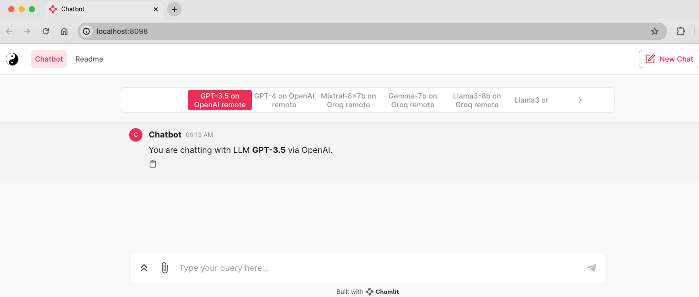

This is a pure experiment on langchain + chainlit + LLM  based chatbot! 

**Prerequisites**:
* To use LLMs via [OpenAI](https://platform.openai.com/docs/models/overview) remotely, an OpenAI API key is required.
* To use LLMs via [Groq](https://wow.groq.com/) remotely, an Groq API key is required.
* To use [Ollama](https://ollama.com/) wrapped [LLMs](https://ollama.com/library) on your own local computer, download and intall [Ollama](https://ollama.com/download).

**Installation**:
1. Clone this repo. 
2. Create a virtual environment in Python via [venv](https://docs.python.org/3/library/venv.html), [conda](https://conda.io/projects/conda/en/latest/user-guide/getting-started.html) or other package manager.
3. Install requirements of Python packages
```pip install -r requirements.txt```
4. To use LLMs remotely provided by OpenAI or Groq, copy and rename the ```.env.example``` file to ```.env```; set your own OpenAI and or Groq API keys. For current functionalities the LANGCHAIN_API_KEY is not required. Currently the code in main.py is using GPT3.5 and GPT4 on OpenAI and Mixtral-8x7b, Gemma-7 and Llam3-8b on Groq. So, please modify main.py accordingly based on your needs.
5. To use [Ollama](https://ollama.com/) wrapped [LLMs](https://ollama.com/library) on your own local computer, download and intall [Ollama](https://ollama.com/download) first and then in terminal run ```ollama pull <model-name>``` to pull the model you need. Currently the code in main.py has [Llama3](https://ollama.com/library/llama3), [Gemma](https://ollama.com/library/gemma), [Phi-3](https://ollama.com/library/phi3), [CodeGemma](https://ollama.com/library/codegemma) and [Deepseek-coder](https://ollama.com/library/deepseek-coder). So, please modify main.py accordingly based on your needs. When using Ollama LLM locally make sure the Ollama app is running. Otherwise, there could be error like ```aiohttp.client_exceptions.ClientConnectorError: Cannot connect to host localhost:``` To run LLMs locally, your computer should be strong engouh with at least 8 CPU cores and 16GB RAM.
   
**Luanch the chatbot:**

In terminal run the following commands
1. ```conda activate <virtural env you created>```
2. ```chainlit run main.py --watch```
   
See other user chainlit commands and options via ```chainlit --help```
```
(langchian-groq-chainlit)  ~/ chainlit --help
Usage: chainlit [OPTIONS] COMMAND [ARGS]...

Options:
  --version  Show the version and exit.
  --help     Show this message and exit.

Commands:
  create-secret
  hello
  init
  lint-translations
  run
```
Options of commmand ```chainlit run```:
```
(langchian-groq-chainlit)  ~/ chainlit run --help
Usage: chainlit run [OPTIONS] TARGET

Options:
  -w, --watch     Reload the app when the module changes
  -h, --headless  Will prevent to auto open the app in the browser
  -d, --debug     Set the log level to debug
  -c, --ci        Flag to run in CI mode
  --no-cache      Useful to disable third parties cache, such as langchain.
  --host TEXT     Specify a different host to run the server on
  --port TEXT     Specify a different port to run the server on
  --help          Show this message and exit.
```
You can use ```--port``` to specify a port, default is 8000. 

**If everything going well you should see a web browser window or tab popped out like below**



Now you can chat with the chatbot! Enjoy! Any questions/comments/suggestions would be appreciated very much!